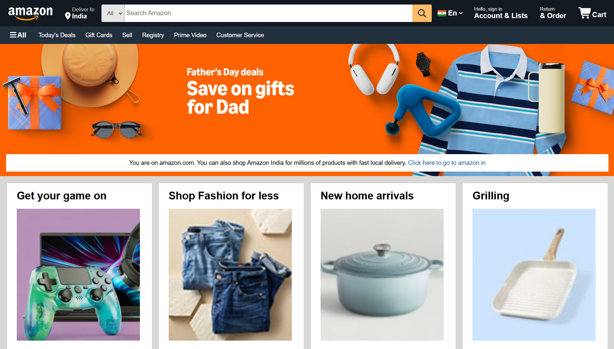

# Amazon.com Clone

A responsive, frontend-only clone of the Amazon.com homepage built entirely with plain HTML and CSS. This project demonstrates modern web layout techniques, UI recreation, and component structuring without the use of JavaScript or external CSS frameworks.

## 🚀 Features

- **Navigation Bar:** Recreated Amazon's iconic top navigation with the logo, search bar, and user account links.
- **Hero Section:** Main banner section welcoming the user.
- **Product Grids:** Card-based layout for product categories and deals using Flexbox/CSS Grid.
- **Footer:** Detailed multi-column footer containing site links and language options.

## 🛠️ Technologies Used

- **HTML5:** Semantic structure and page layout.
- **CSS3:** Styling, Flexbox, hover effects, and responsive design techniques.

## 📷 Screenshots



## 💡 What I Learned

- Structuring a complex, real-world webpage layout from scratch.
- Using Flexbox to align items perfectly in the header and product grids.
- Managing spacing, typography, and colors to match an existing brand's design system.

## 🏃‍♂️ How to Run Locally

Since this is a static frontend project, running it is incredibly simple:

1. Clone the repository:
   ```bash
   git clone https://github.com/Saksham-Sharawat/Amazon.com-clone.git
   ```
2. Navigate to the project folder.
3. Double-click the `index.html` file to open it in your default web browser. No local server required!
